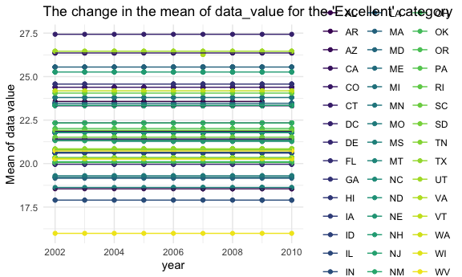
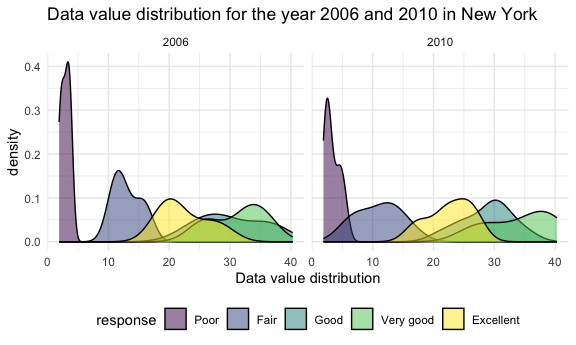
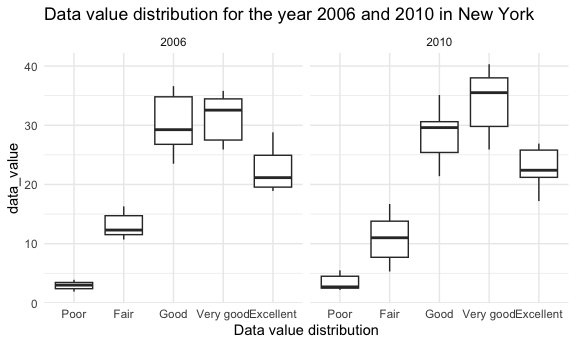
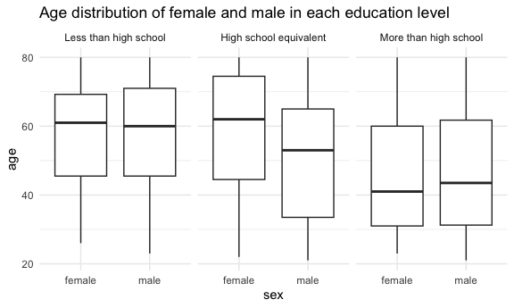
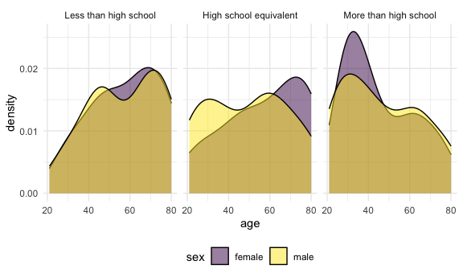
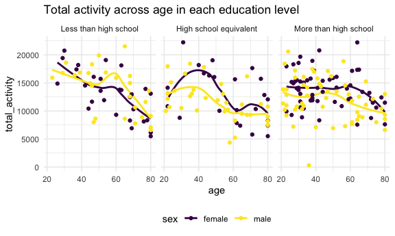

p8105_hw3_tj2519
================
2023-10-09

# Problem 1

## part1: load the library and dataset

``` r
library(tidyverse)
```

    ## ── Attaching core tidyverse packages ──────────────────────── tidyverse 2.0.0 ──
    ## ✔ dplyr     1.1.3     ✔ readr     2.1.4
    ## ✔ forcats   1.0.0     ✔ stringr   1.5.0
    ## ✔ ggplot2   3.4.3     ✔ tibble    3.2.1
    ## ✔ lubridate 1.9.2     ✔ tidyr     1.3.0
    ## ✔ purrr     1.0.2     
    ## ── Conflicts ────────────────────────────────────────── tidyverse_conflicts() ──
    ## ✖ dplyr::filter() masks stats::filter()
    ## ✖ dplyr::lag()    masks stats::lag()
    ## ℹ Use the conflicted package (<http://conflicted.r-lib.org/>) to force all conflicts to become errors

``` r
library(ggridges)
library(ggplot2)
library(p8105.datasets)
data("instacart")

knitr::opts_chunk$set(
  fig.width = 6,
  fig.asp = .6,
  out.width = "90%"
)

theme_set(theme_minimal() + theme(legend.position = "bottom"))

options(
  ggplot2.continuous.colour = "viridis",
  ggplot2.continuous.fill = "viridis"
)

scale_colour_discrete = scale_colour_viridis_d
scale_fill_discrete = scale_fill_viridis_d
```

## part2: calculate the number of aisles and number of items in each aisle

``` r
problem1_df = instacart 
problem1_df %>% 
  group_by(aisle_id) %>% 
  summarize(n_obs = n()) %>% 
  arrange(desc(n_obs))
```

    ## # A tibble: 134 × 2
    ##    aisle_id  n_obs
    ##       <int>  <int>
    ##  1       83 150609
    ##  2       24 150473
    ##  3      123  78493
    ##  4      120  55240
    ##  5       21  41699
    ##  6      115  36617
    ##  7       84  32644
    ##  8      107  31269
    ##  9       91  26240
    ## 10      112  23635
    ## # ℹ 124 more rows

``` r
view(problem1_df)
```

## part3: make a plot showing the number of items ordered in each aisle

``` r
problem1_df %>% 
  group_by(aisle_id) %>% 
  summarize(number_item = n()) %>% 
  filter(number_item > 10000) %>% 
  ggplot(aes(x = reorder(aisle_id, -number_item), y = number_item)) +
  geom_bar(stat = "identity", width = 0.5) + 
  theme(axis.text.x = element_text(size = 6)) +
  xlab("aisle_id") 
```


## part4: make a table

``` r
problem1_df %>% 
  group_by(aisle, product_name) %>% 
  filter(aisle == "baking ingredients" |
           aisle == "dog food care" |
           aisle == "packaged vegetables fruits"
           ) %>% 
  summarize(order_num = n()) %>% 
  arrange(aisle, desc(order_num)) %>% 
  slice(1:3) %>% 
  pivot_wider(names_from = aisle,
              values_from = order_num)
```

    ## `summarise()` has grouped output by 'aisle'. You can override using the
    ## `.groups` argument.

    ## # A tibble: 9 × 4
    ##   product_name       `baking ingredients` `dog food care` packaged vegetables …¹
    ##   <chr>                             <int>           <int>                  <int>
    ## 1 Light Brown Sugar                   499              NA                     NA
    ## 2 Pure Baking Soda                    387              NA                     NA
    ## 3 Cane Sugar                          336              NA                     NA
    ## 4 Snack Sticks Chic…                   NA              30                     NA
    ## 5 Organix Chicken &…                   NA              28                     NA
    ## 6 Small Dog Biscuits                   NA              26                     NA
    ## 7 Organic Baby Spin…                   NA              NA                   9784
    ## 8 Organic Raspberri…                   NA              NA                   5546
    ## 9 Organic Blueberri…                   NA              NA                   4966
    ## # ℹ abbreviated name: ¹​`packaged vegetables fruits`

## part5: make a new table

``` r
problem1_df %>% 
  filter(product_name == "Pink Lady Apples" | 
           product_name == "Coffee Ice Cream") %>% 
  group_by(product_name, order_dow) %>% 
  summarize(mean_order_time = mean(order_hour_of_day, na.rm = TRUE)) %>% 
  pivot_wider(names_from = order_dow,
              values_from = mean_order_time)
```

    ## `summarise()` has grouped output by 'product_name'. You can override using the
    ## `.groups` argument.

    ## # A tibble: 2 × 8
    ## # Groups:   product_name [2]
    ##   product_name       `0`   `1`   `2`   `3`   `4`   `5`   `6`
    ##   <chr>            <dbl> <dbl> <dbl> <dbl> <dbl> <dbl> <dbl>
    ## 1 Coffee Ice Cream  13.8  14.3  15.4  15.3  15.2  12.3  13.8
    ## 2 Pink Lady Apples  13.4  11.4  11.7  14.2  11.6  12.8  11.9

# Problem 2

## part1: load the library and dataset

``` r
library(p8105.datasets)
data("brfss_smart2010") 

view(brfss_smart2010)
```

## part2: cleaning the data

``` r
problem2_df = brfss_smart2010

problem2_clean = problem2_df %>% 
  janitor::clean_names() %>% 
  rename(location_abbr = locationabbr, location_desc_order = locationdesc) %>% 
  filter(topic == "Overall Health") %>% 
  drop_na(response) %>% 
  mutate(response = forcats::fct_relevel(
    response, c("Poor", "Fair", "Good", "Very good", "Excellent")))
```

## part3: answer the first question

``` r
state_2002 = problem2_clean %>%
  filter(year == 2002) %>% 
  group_by(location_abbr) %>% 
  summarize(n_location = n_distinct(location_desc_order)) %>% 
  filter(n_location >= 7)

problem2_clean %>%
  filter(year == 2002) %>% 
  group_by(location_abbr) %>% 
  summarize(n_location = n_distinct(geo_location)) %>% 
  filter(n_location >= 7)
```

    ## # A tibble: 6 × 2
    ##   location_abbr n_location
    ##   <chr>              <int>
    ## 1 CT                     7
    ## 2 FL                     7
    ## 3 MA                     8
    ## 4 NC                     7
    ## 5 NJ                     8
    ## 6 PA                    10

``` r
state_2007 = problem2_clean %>%
  filter(year == 2010) %>% 
  group_by(location_abbr) %>% 
  summarize(n_location = n_distinct(location_desc_order)) %>% 
  filter(n_location >= 7)
```

According to the results, in 2002, 6 states were observed at 7 or more
locations (counties), and the 6 states are “CT, FL, MA, NC, NJ, PA”. In
2010, 14 states were observed at 7 or more locations (counties), and the
14 states are “CA, CO, FL, MA, MD, NC, NE, NJ, NY, OH, PA, SC, TX, WA”.

## part4: answer the second question

``` r
problem2_clean %>% 
  filter(response == "Excellent") %>% 
  group_by(location_abbr, year) %>% 
  summarize(data_value_mean = mean(data_value, na.rm = TRUE)) %>%
  ggplot(aes(x = year, y = data_value_mean, group = location_abbr, 
             color = location_abbr)) +
  geom_line() +
  theme_minimal() + 
  labs(title = "The change in the mean of data_value for the 'Excellent' category",
       y = "Mean of data value")
```

    ## `summarise()` has grouped output by 'location_abbr'. You can override using the
    ## `.groups` argument.


To make this plot, I move the legend to the right of the plot so it
could be more clear. The plot indicates the mean data value change
across time (from 2002 to 2010) in each state (with ‘Excellent’ health).

## part5: answer the third question

``` r
problem2_clean %>% 
  filter(location_abbr == "NY", year == 2006 | year == 2010) %>% 
  ggplot(aes(x = data_value, fill = response)) +
  geom_density(alpha = .5) +
  facet_grid(. ~ year) +
  labs(title = "Data value distribution for the year 2006 and 2010 in New York (density plot)",
       x = "Data value distribution")
```



``` r
problem2_clean %>% 
  filter(location_abbr == "NY", year == 2006 | year == 2010) %>% 
  group_by(year) %>% 
  ggplot(aes(x = response, y = data_value)) +
  geom_boxplot() +
  facet_grid(. ~ year) +
  labs(title = "Data value distribution for the year 2006 and 2010 in New York (box plot)",
       x = "Data value distribution")
```


I firstly filter the datset to include only the data in NY and only the
observations from 2006 and 2010. Then, to show the distribution of each
response type, I draw a density plot. Then, we split the plot according
to the value of each year.

# Problem 3

## part1: read the two datasets and tidy the two datasets, also apply left_join by “seqn” to merge the two datasets. Also recode certain variables

``` r
demo_data = 
  read_csv("data/nhanes_covar.csv", skip = 4) %>% 
  janitor::clean_names() %>% 
  filter(age >= 21) %>% 
  drop_na() %>% 
  mutate(sex = recode(sex, `2` = "female", `1` = "male"),
         education = recode(education, `1` = "Less than high school", 
                                      `2` = "High school equivalent",
                                      `3` = "More than high school")) %>% 
  mutate(education = forcats::fct_relevel(
    education, c("Less than high school", "High school equivalent", 
                 "More than high school")))
```

    ## Rows: 250 Columns: 5
    ## ── Column specification ────────────────────────────────────────────────────────
    ## Delimiter: ","
    ## dbl (5): SEQN, sex, age, BMI, education
    ## 
    ## ℹ Use `spec()` to retrieve the full column specification for this data.
    ## ℹ Specify the column types or set `show_col_types = FALSE` to quiet this message.

``` r
acc_data =
  read_csv("data/nhanes_accel.csv") %>% 
  janitor::clean_names()
```

    ## Rows: 250 Columns: 1441
    ## ── Column specification ────────────────────────────────────────────────────────
    ## Delimiter: ","
    ## dbl (1441): SEQN, min1, min2, min3, min4, min5, min6, min7, min8, min9, min1...
    ## 
    ## ℹ Use `spec()` to retrieve the full column specification for this data.
    ## ℹ Specify the column types or set `show_col_types = FALSE` to quiet this message.

``` r
demo_acc_join = 
  left_join(demo_data, acc_data, by = "seqn")


view(acc_data)
view(demo_data)
view(demo_acc_join)
```

## part2: make a table indicating the number of each sex in each education level and make a plot showing the distribution of age in the two genders in each education level

``` r
demo_acc_join %>% 
  group_by(education, sex) %>% 
  summarize(number_count = n()) %>% 
  pivot_wider(names_from = sex, values_from = number_count)
```

    ## `summarise()` has grouped output by 'education'. You can override using the
    ## `.groups` argument.

    ## # A tibble: 3 × 3
    ## # Groups:   education [3]
    ##   education              female  male
    ##   <fct>                   <int> <int>
    ## 1 Less than high school      28    27
    ## 2 High school equivalent     23    35
    ## 3 More than high school      59    56

``` r
demo_acc_join %>% 
  ggplot(aes(x = sex, y = age)) +
  geom_boxplot() + 
  facet_grid(. ~ education) +
  labs(title = "Age distribution of female and male in each education level")
```



``` r
demo_acc_join %>% 
  ggplot(aes(x = age, fill = sex)) +
  geom_density(alpha = .5) +
  facet_grid(. ~ education)
```


The table indicates that the number of female and male who has a degree
of ‘Less than high school’ is almost equal; among the people with a High
school degree or equivalent, the number of female is less than the
number of male; among the people with a more than high school degree,
the number of female and male is almost equal.

According to the box plot, the median age of female and male with a less
than a high school degree is similar, and the age distributions for the
two genders are similar; the median age of female with a ‘High school
equivalent’ degree is older than male, and the age distributions for the
two genders are similar, with males slightly younger than females; the
median age of female with a ‘More than high school’ degree is similar,
and the age distributions for the two genders are similar.

## part3: aggregate the “min” variables to create a single variable, and making a plot

``` r
demo_acc_join %>% 
  pivot_longer(starts_with("min"), 
               names_to = "activity",
               values_to = "activity_value") %>% 
  group_by(education, sex, age, seqn) %>% 
  summarize(total_activity = sum(activity_value)) %>% 
  ggplot(aes(x = age, y = total_activity, color = sex)) +
  geom_smooth(se = FALSE) +
  geom_point() +
  facet_grid(. ~ education) +
  labs(title = "Total activity across age in each education level")
```

    ## `summarise()` has grouped output by 'education', 'sex', 'age'. You can override
    ## using the `.groups` argument.
    ## `geom_smooth()` using method = 'loess' and formula = 'y ~ x'


The plot shows the total activity across age in each education level,
and the trend line in each education level seems to have a trend - with
younger age, the total activity is higher. In high school equivalent and
more than high school group, female seem to have higher total activity
than male.

## part4: make a plot showing the 24-hr activity for each education level and stratified by sex

``` r
demo_acc_join %>% 
  pivot_longer(starts_with("min"), 
               names_to = "activity_time",
               values_to = "activity_value") %>%
  mutate(activity_time = substr(activity_time, start = 4, stop = 100)) %>% 
  mutate(activity_time = as.numeric(activity_time)) %>% 
  ggplot(aes(x = activity_time, y = activity_value, color = sex)) + 
  geom_smooth(aes(group = sex), se = FALSE) +
  facet_grid(. ~ education) +
  labs(title = "The activity across 24 hrs in each education level stratified by sex",
       x = "activity time (min)")
```


The plot illustrates the activity across time in each observation
(stratified by sex) in each education level.Within the 24-hr period, the
activity seems to be the lowest at around the 250th min in each
education group, and the highest activity seem to appear at around the
750th min in each education group.
