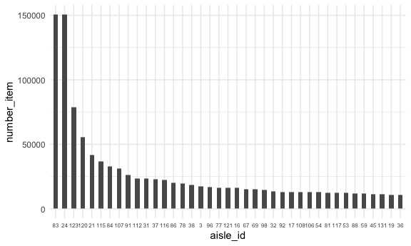

p8105_hw3_tj2519
================
2023-10-09

# Problem 1

## part1: load the library and dataset

``` r
library(tidyverse)
```

    ## ── Attaching core tidyverse packages ──────────────────────── tidyverse 2.0.0 ──
    ## ✔ dplyr     1.1.3     ✔ readr     2.1.4
    ## ✔ forcats   1.0.0     ✔ stringr   1.5.0
    ## ✔ ggplot2   3.4.3     ✔ tibble    3.2.1
    ## ✔ lubridate 1.9.2     ✔ tidyr     1.3.0
    ## ✔ purrr     1.0.2     
    ## ── Conflicts ────────────────────────────────────────── tidyverse_conflicts() ──
    ## ✖ dplyr::filter() masks stats::filter()
    ## ✖ dplyr::lag()    masks stats::lag()
    ## ℹ Use the conflicted package (<http://conflicted.r-lib.org/>) to force all conflicts to become errors

``` r
library(ggridges)
library(p8105.datasets)
data("instacart")

knitr::opts_chunk$set(
  fig.width = 6,
  fig.asp = .6,
  out.width = "90%"
)

theme_set(theme_minimal() + theme(legend.position = "bottom"))

options(
  ggplot2.continuous.colour = "viridis",
  ggplot2.continuous.fill = "viridis"
)

scale_colour_discrete = scale_colour_viridis_d
scale_fill_discrete = scale_fill_viridis_d
```

## part2: calculate the number of aisles and number of items in each aisle

``` r
problem1_df = instacart 
problem1_df %>% 
  group_by(aisle_id) %>% 
  summarize(n_obs = n()) %>% 
  arrange(desc(n_obs))
```

    ## # A tibble: 134 × 2
    ##    aisle_id  n_obs
    ##       <int>  <int>
    ##  1       83 150609
    ##  2       24 150473
    ##  3      123  78493
    ##  4      120  55240
    ##  5       21  41699
    ##  6      115  36617
    ##  7       84  32644
    ##  8      107  31269
    ##  9       91  26240
    ## 10      112  23635
    ## # ℹ 124 more rows

``` r
view(problem1_df)
```

## part3: make a plot showing the number of items ordered in each aisle

``` r
problem1_df %>% 
  group_by(aisle_id) %>% 
  summarize(number_item = n()) %>% 
  filter(number_item > 10000) %>% 
  ggplot(aes(x = reorder(aisle_id, -number_item), y = number_item)) +
  geom_bar(stat = "identity", width = 0.5) + 
  theme(axis.text.x = element_text(size = 6)) +
  xlab("aisle_id") 
```



## part4: make a table

``` r
problem1_df %>% 
  group_by(aisle, product_name) %>% 
  filter(aisle == "baking ingredients" |
           aisle == "dog food care" |
           aisle == "packaged vegetables fruits"
           ) %>% 
  summarize(order_num = n()) %>% 
  arrange(aisle, desc(order_num)) %>% 
  slice(1:3) %>% 
  pivot_wider(names_from = aisle,
              values_from = order_num)
```

    ## `summarise()` has grouped output by 'aisle'. You can override using the
    ## `.groups` argument.

    ## # A tibble: 9 × 4
    ##   product_name       `baking ingredients` `dog food care` packaged vegetables …¹
    ##   <chr>                             <int>           <int>                  <int>
    ## 1 Light Brown Sugar                   499              NA                     NA
    ## 2 Pure Baking Soda                    387              NA                     NA
    ## 3 Cane Sugar                          336              NA                     NA
    ## 4 Snack Sticks Chic…                   NA              30                     NA
    ## 5 Organix Chicken &…                   NA              28                     NA
    ## 6 Small Dog Biscuits                   NA              26                     NA
    ## 7 Organic Baby Spin…                   NA              NA                   9784
    ## 8 Organic Raspberri…                   NA              NA                   5546
    ## 9 Organic Blueberri…                   NA              NA                   4966
    ## # ℹ abbreviated name: ¹​`packaged vegetables fruits`

## part5: make a new table

``` r
problem1_df %>% 
  filter(product_name == "Pink Lady Apples" | 
           product_name == "Coffee Ice Cream") %>% 
  group_by(product_name, order_dow) %>% 
  summarize(mean_order_time = mean(order_hour_of_day, na.rm = TRUE)) %>% 
  pivot_wider(names_from = order_dow,
              values_from = mean_order_time)
```

    ## `summarise()` has grouped output by 'product_name'. You can override using the
    ## `.groups` argument.

    ## # A tibble: 2 × 8
    ## # Groups:   product_name [2]
    ##   product_name       `0`   `1`   `2`   `3`   `4`   `5`   `6`
    ##   <chr>            <dbl> <dbl> <dbl> <dbl> <dbl> <dbl> <dbl>
    ## 1 Coffee Ice Cream  13.8  14.3  15.4  15.3  15.2  12.3  13.8
    ## 2 Pink Lady Apples  13.4  11.4  11.7  14.2  11.6  12.8  11.9

# Problem 2

## part1: load the library and dataset

``` r
library(p8105.datasets)
data("brfss_smart2010") 

view(brfss_smart2010)
```

## part2: cleaning the data

``` r
problem2_df = brfss_smart2010

problem2_clean = problem2_df %>% 
  janitor::clean_names() %>% 
  rename(location_abbr = locationabbr, location_desc_order = locationdesc) %>% 
  filter(topic == "Overall Health") %>% 
  drop_na(response) %>% 
  mutate(response = forcats::fct_relevel(
    response, c("Poor", "Fair", "Good", "Very good", "Excellent")))
```

## part3: answer the first question

``` r
state_2002 = problem2_clean %>%
  filter(year == 2002) %>% 
  group_by(location_abbr) %>% 
  summarize(n_location = n_distinct(location_desc_order)) %>% 
  filter(n_location >= 7)

problem2_clean %>%
  filter(year == 2002) %>% 
  group_by(location_abbr) %>% 
  summarize(n_location = n_distinct(geo_location)) %>% 
  filter(n_location >= 7)
```

    ## # A tibble: 6 × 2
    ##   location_abbr n_location
    ##   <chr>              <int>
    ## 1 CT                     7
    ## 2 FL                     7
    ## 3 MA                     8
    ## 4 NC                     7
    ## 5 NJ                     8
    ## 6 PA                    10

``` r
state_2007 = problem2_clean %>%
  filter(year == 2010) %>% 
  group_by(location_abbr) %>% 
  summarize(n_location = n_distinct(location_desc_order)) %>% 
  filter(n_location >= 7)
```

According to the results, in 2002, 6 states were observed at 7 or more
locations (counties), and the 6 states are “CT, FL, MA, NC, NJ, PA”. In
2010, 14 states were observed at 7 or more locations (counties), and the
14 states are “CA, CO, FL, MA, MD, NC, NE, NJ, NY, OH, PA, SC, TX, WA”.
